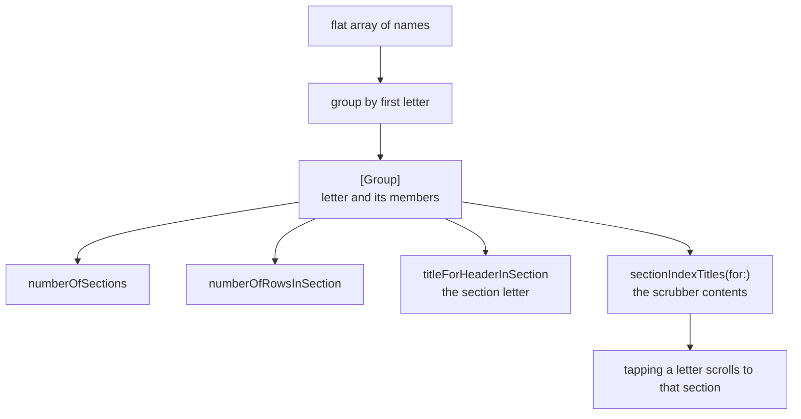

# Table View Index

*The alphabetical scrubber down the side of a sectioned list.*

    

## Overview

The index strip used by Contacts. Two data source methods provide it, but they only work if the underlying data is genuinely grouped by first letter, which is the part that has to be built.

## How it works



## Implementation notes

- **The index mirrors the sections.** `sectionIndexTitles` must line up with the section order, otherwise a tap scrolls to the wrong place.
- **Grouping happens once.** The array is transformed into a `Group` model at setup rather than being filtered inside the data source methods, which would run on every cell.
- **Letters without entries are skipped.** Only letters that actually have members become sections, so the list has no empty headers.
- **Headers and index share a source.** Both read from the same model, so they cannot disagree.

## Project structure

```
TableViewIndex/
└── ViewController.swift   Group model, data source and index
```

## Requirements

Xcode 15 or later, iOS 17.5 or later. No external dependencies.
